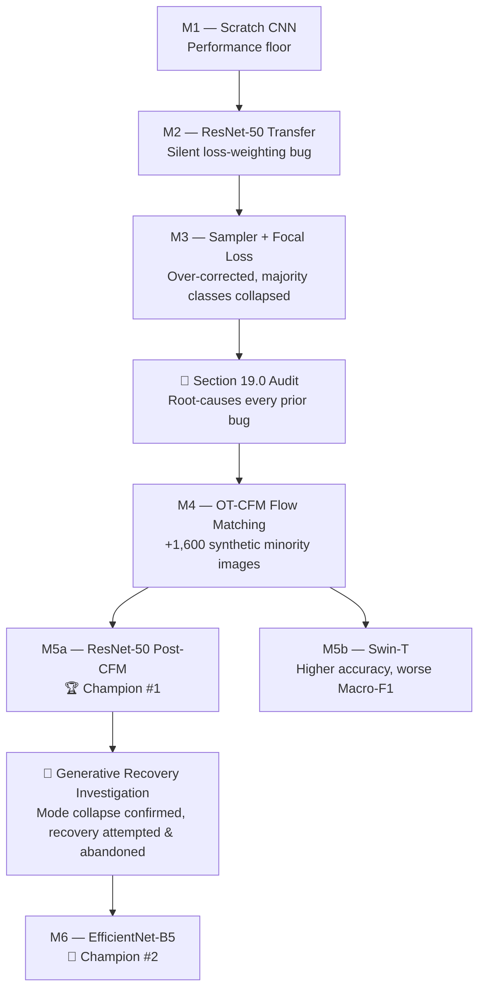

# 👁️ RetinaFlow

### Dual-Model Retinal Disease Classifier — ResNet-50 & EfficientNet-B5, trained on a severely imbalanced 11.8K-image clinical dataset, augmented with OT-CFM (Flow Matching) synthetic generation.


> ⚠️ **This is a research/educational project, not a certified medical device.** It is not intended for clinical use, diagnosis, or treatment decisions. See [Disclaimer](#-disclaimer).

---

## 📖 Table of Contents

- [Overview](#-overview)
- [The Core Challenge: Extreme Class Imbalance](#-the-core-challenge-extreme-class-imbalance)
- [Dataset](#-dataset)
- [The Research Journey](#-the-research-journey)
- [Final Benchmark Results](#-final-benchmark-results)
- [Key Technical Contributions](#-key-technical-contributions)
- [Repository Structure](#-repository-structure)
- [The App](#-the-app)
- [Installation & Usage](#-installation--usage)
- [Limitations & Honest Caveats](#-limitations--honest-caveats)
- [Disclaimer](#-disclaimer)
- [Acknowledgments](#-acknowledgments)

---

## 🔬 Overview

**RetinaFlow** is an end-to-end deep learning pipeline that classifies retinal fundus photographs into **8 diagnostic categories**:

`AMD` · `Cataract` · `Diabetic Retinopathy` · `Glaucoma` · `Hypertension` · `Myopia` · `Normal` · `Others`

Rather than presenting a single "best" model and hiding its weaknesses, this project documents a **complete, honest experimentation log** — every architecture tried, every bug found and fixed, every hypothesis tested and killed — and ships **two champion models side by side**, letting the end user choose the trade-off that matters for their use case:

| | Optimizes for | Best for |
|---|---|---|
| 🏆 **M5a — ResNet-50** | Overall diagnostic accuracy | General-purpose screening |
| 🎯 **M6 — EfficientNet-B5** | Minority-class sensitivity | Not missing rare, high-risk cases |

---

## ⚖️ The Core Challenge: Extreme Class Imbalance

The real obstacle in this project was never "build a classifier" — it was **severe class skew**. A model that blindly predicts `Normal` or `Diabetic Retinopathy` for everything already scores ~74% accuracy while being clinically useless.

| Class | Train Pool | Test Set | Imbalance Ratio (vs. Normal) |
|---|---:|---:|---:|
| Normal | 4,698 | 705 | 1.0× |
| Diabetic Retinopathy | 4,113 | 617 | 1.1× |
| Others | 1,102 | 165 | 4.3× |
| Glaucoma | 930 | 140 | 5.1× |
| Cataract | 340 | 51 | 13.8× |
| Myopia | 294 | 44 | 16.0× |
| AMD | 274 | 41 | 17.1× |
| **Hypertension** | **88** | **13** | **53.4×** |

Because Hypertension had only 88 real training images (and just 13 in the test set), **Hypertension recall became this project's critical benchmark metric** — and its statistical volatility (each misclassified image swings recall by ~7.7pp) is called out explicitly throughout the notebook rather than glossed over.

---

## 📊 Dataset

**11,839 real fundus photographs**, unified from 4 public clinical registries:

| Source Registry | Images | Share |
|---|---:|---:|
| ODIR-5K | 7,000 | 59.1% |
| APTOS-2019 | 3,484 | 29.4% |
| ACRIMA | 705 | 6.0% |
| ORIGA | 650 | 5.5% |

All models are evaluated on the **exact same** strictly isolated, held-out, **100% real** test set of **1,776 images** — no model was ever tested on synthetic data, and every row in the results table below is directly comparable.

---

## 🧭 The Research Journey

The notebook (`EyeDisease.ipynb`, 122 cells) documents six model generations, each a response to a specific, diagnosed failure in the one before it:



**Highlights along the way:**

- **M1 (Scratch CNN):** 92.3% Hypertension recall looked amazing — until you notice overall accuracy was 23%. A near-random model over-predicts rare classes by noise. Lesson: never read one metric in isolation.
- **M2 (ResNet-50):** Accuracy jumped to 69%, but Hypertension recall *collapsed* to 7.7%. Root cause, found later in the Section 19.0 audit: the "weighted" loss silently ran as plain Cross-Entropy due to a variable-scoping bug (`class_weights` out of scope at runtime).
- **M3 (Sampler + Focal Loss):** Stacking *two* independent imbalance-correction mechanisms at once over-corrected so hard that Normal-class recall dropped to 6.8%. Textbook double-correction failure.
- **Section 19.0 Audit:** A full stop-and-diagnose pass before building anything else — it surfaced the M2 bug, the flawed val-loss checkpoint selection used in M1–M3, the M3 double-correction, and the lack of any quantitative synthetic-data quality check.
- **M4 (OT-CFM Flow Matching):** A class-conditional Optimal Transport Conditional Flow Matching model generated 1,600 synthetic images for the 4 weakest classes (+600 Hypertension, +350 AMD, +350 Myopia, +300 Cataract).
- **Generative Recovery Investigation (19.1–19.5):** A feature-space diversity audit using frozen ResNet-50 embeddings found ~30% mode collapse in the synthetic images. A targeted fine-tuning recovery attempt was tried, measured, and found inconclusive (one class even regressed) — so the generative-model recovery path was **deliberately discontinued** rather than chased indefinitely. This is documented as a clean, evidence-based stopping point, not a failure to hide.
- **M5b (Swin-T) vs. M5a (ResNet-50):** The newer transformer architecture did *not* win — ResNet-50 generalized better on Macro-F1 and minority recall, a reminder that architecture novelty isn't automatically better without enough data to justify the extra capacity.
- **M6 (EfficientNet-B5):** Built after correcting the checkpoint-selection and class-weighting bugs, explicitly optimized as the "catch rare cases" counterpart to M5a.

---

## 🏆 Final Benchmark Results

All numbers below are from the same 1,776-image, 100%-real, held-out test set.

| Model | Accuracy | Macro-F1 | Weighted-F1 | Hypertension Recall | Verdict |
|---|---:|---:|---:|---:|---|
| M1 — Scratch CNN | 23.37% | 0.228 | 0.184 | 92.3% | Near-random; high recall is a noise artifact |
| M2 — ResNet-50 (standard) | 69.14% | 0.534 | 0.669 | 7.7% | Strong accuracy; silent bug collapsed minority recall |
| M3 — ResNet-50 (Sampler + Focal) | 25.73% | 0.298 | 0.257 | 69.2% | Over-corrected; majority classes destroyed |
| **M5a — ResNet-50 (Post-Flow-Matching)** | **71.68%** | **0.600** | **0.710** | 15.4% | 🏆 **Best overall — shipped as "General-Purpose"** |
| M5b — Swin-T | 72.24% | 0.573 | 0.711 | 7.7% | Higher raw accuracy, worse Macro-F1 & minority recall |
| **M6 — EfficientNet-B5** | 62.61% | 0.570 | 0.653 | **38.5%** | 🎯 **Best minority sensitivity — shipped as "High-Sensitivity"** |

> Note: Hypertension recall figures are computed on only **13 test images** and carry high variance — a single misclassification shifts the number by ~7.7 percentage points. Treat these as directional, not precise.

---

## 🛠️ Key Technical Contributions

- **OT-CFM Flow Matching for medical data augmentation** — a class-conditional Optimal Transport Conditional Flow Matching generative model (velocity-field estimator, trained to convergence at loss 0.0235) used to synthesize minority-class fundus images, rather than relying on GANs or classic geometric augmentation alone.
- **Quantitative synthetic-data quality auditing** — synthetic image diversity was measured against real images using frozen ResNet-50 embeddings *before* trusting the generated data at scale, catching a ~30% mode-collapse signal that a purely visual inspection would likely have missed.
- **Bug-driven, not vibes-driven, iteration** — every regression (M2's collapse, M3's over-correction) was root-caused with evidence before the next architecture was chosen, culminating in a dedicated audit section (19.0) and corrected, reusable utilities (safe class weighting + Macro-F1 checkpoint selection) used for every model built afterward.
- **Grad-CAM clinical explainability** — verified that models attend to clinically plausible structures (optic disc cupping for Glaucoma, foveal drusen for AMD, hemorrhages/microaneurysms for Diabetic Retinopathy) rather than spurious background features.
- **Deliberate dual-model deployment** — instead of picking one model and quietly absorbing its blind spot, both champions are shipped with an explicit, in-UI trade-off explanation.

---

## 📁 Repository Structure

```
RetinaFlow/
├── app.py                       # Gradio web app — dual-model inference + MCP server
├── requirements.txt             # Runtime dependencies for app.py
├── README.md                    # This file
├── EyeDisease.ipynb             # Full research notebook (122 cells, training → export)
├── models/
│   ├── resnet50_m5a.onnx        # M5a — ResNet-50, 224×224 input, General-Purpose
│   └── efficientnet_b5_m6.onnx  # M6 — EfficientNet-B5, 300×300 input, High-Sensitivity
└── assets/
    └── samples/                 # Curated example fundus images (one per class)
```

---

## 🖥️ The App

`app.py` is a **Gradio** application with:

- **Dual-model inference** via **ONNX Runtime** (`CPUExecutionProvider`) — no GPU required.
- **Per-model resolution dispatch** — 224×224 for ResNet-50, 300×300 for EfficientNet-B5, both with ImageNet normalization.
- **Result caching** — SHA-256 hash of the uploaded image, so repeated queries skip re-inference.
- **MCP server support** (`mcp_server=True`) with a single scoped public endpoint (`classify`), so the classifier can also be called as an [MCP](https://modelcontextprotocol.io/) tool from any compatible client.
- **"Quantum Black" custom theme** and an explicit, always-visible trade-off banner explaining the two models before any prediction is shown.

---

## 🚀 Installation & Usage

```bash
# 1. Clone the repository
git clone https://github.com/markegyptian55-cloud/RetinaFlow.git
cd RetinaFlow

# 2. Install dependencies
pip install -r requirements.txt

# 3. Run the app
python app.py
```

The app will start a local Gradio interface (and, per Colab/HF Space environment, may also expose a temporary public share link). Upload a fundus image, choose a model, and click **Classify**.

### Reproducing the training pipeline

The full training journey — from the scratch CNN through OT-CFM augmentation to the final ONNX export — lives in `EyeDisease.ipynb`. It was developed on Google Colab (Tesla T4 GPU) and expects the raw dataset structure described in Section 3.0 of the notebook.

---

## ⚠️ Limitations & Honest Caveats

This README follows the same principle as the notebook itself: no cherry-picking.

- **Hypertension numbers are statistically fragile.** A 13-image test set means every recall figure for that class should be read as directional, not precise.
- **Neither champion model is "solved."** M5a still misses the majority of Hypertension cases; M6 trades away real accuracy on common classes to catch more of them.
- **The generative augmentation path has a known, unresolved limitation** (synthetic mode collapse, ~30% diversity loss vs. real images) that was diagnosed but not fully fixed within project scope.
- **This is not a validated clinical tool.** No external clinical validation, regulatory review, or deployment safety testing has been performed.

---

## 🩺 Disclaimer

This project is provided strictly for **research and educational purposes**. It is **not** a certified medical device and **must not** be used for actual clinical diagnosis, screening, or treatment decisions. Always consult a qualified ophthalmologist or medical professional for any real diagnostic concern.

---

## 🙏 Acknowledgments

Built on top of the following public clinical fundus image registries: **ODIR-5K**, **APTOS-2019**, **ACRIMA**, and **ORIGA**. Full credit to their original creators and maintainers for making this research possible.

---

<p align="center">Made with 🔬 and a refusal to hide bad results.</p>
